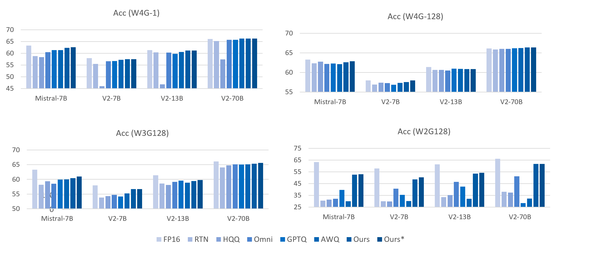

## Add Auto-Round Support

Hi, here is the INC team from Intel. Thank you for developing this amazing project.

### Motivation 

Our team have developed a new weight-only quantization algorithm called Auto-Round. It has achieved superior accuracy compared to [GPTQ](https://arxiv.org/abs/2210.17323), [AWQ](https://arxiv.org/abs/2306.00978), [OmniQuant](https://arxiv.org/abs/2308.13137), and [HQQ](https://mobiusml.github.io/hqq_blog/) across 11 tasks, particularly excelling in low-bit quantization (e.g., 2-bits and 3-bits). Auto-Round supports quantization from 2 to 8 bits, involves low tuning costs, and imposes no additional overhead during inference. Key results are summarized below, with detailed information available in our [paper](https://arxiv.org/abs/2309.05516) and [code repository](https://github.com/intel/auto-round/blob/main/docs/acc.md).




We would like to contribute this quantization algorithm to TGI to enable users to:

1. Quantize a floating model using Auto-Round.
2. Perform inference using the quantized model.

### 1. Quantize Floating Model Using Auto-Round

Extend the current `quantize` API and add `method` as a new argument to select different algorithms. Users can utilize it as follows:

```bash
text-generation-server quantize \
    --MODEL_ID path/to/float/model/\
    --OUTPUT_DIR /path/to/save/quantized/model \
    --method autoround # <--- select the different methods, such as `gptq`, `autoround`
```

<!-- https://github.com/huggingface/text-generation-inference/blob/11ea9ce002e796cc59714950b557b4021cbebc58/server/text_generation_server/cli.py#L300-L319 -->

We propose two options to implement it:

#### Option 1: Adding Auto-Round as a New Python Dependency (Recommended)

Auto-Round is currently released as a pure [Python binary](https://pypi.org/project/auto-round/). The option prefer include `auto-round` in TGI's [`requirements_xx.txt`](https://github.com/huggingface/text-generation-inference/blob/main/server/requirements_cuda.txt) and utilize Auto-Round's API to obtain the quantized model.

Advantages:

- Minimal maintenance effort for TGI. We already integrated it into our [INC](https://github.com/intel/neural-compressor) project, and enabled the integration tests.
- Easy synchronization with new enhancements. As we continually improve the Auto-Round algorithm, updates can be effortlessly incorporated into TGI by updating the package version.

### Option 2: Porting All Source Code of Auto-Round into TGI

We are also willing to integrate all source code of Auto-Round directly into TGI.  

Advantages:

- No third-party dependency introduced.
- TCI maintainers have better control.

### 2. Inference AutoRound-Quantized Model
After obtaining the quantized model using Auto-Round, users can use it like other algorithms by specifying `--quantize` with `autoround`.

```bash
text-generation-launcher \
    --model-id INC/Llama-2-7b-Chat-Autoround \
    --trust-remote-code --port 8080 \
    --max-input-length 3072 --max-total-tokens 4096 --max-batch-prefill-tokens 4096 \
    --quantize autoround   # <------ select Auto-Round
```


Your feedback is important. Please feel free to comment on the options mentioned above or suggest additional approaches to ensure the most appropriate contribution method :). Thank you in advance!
